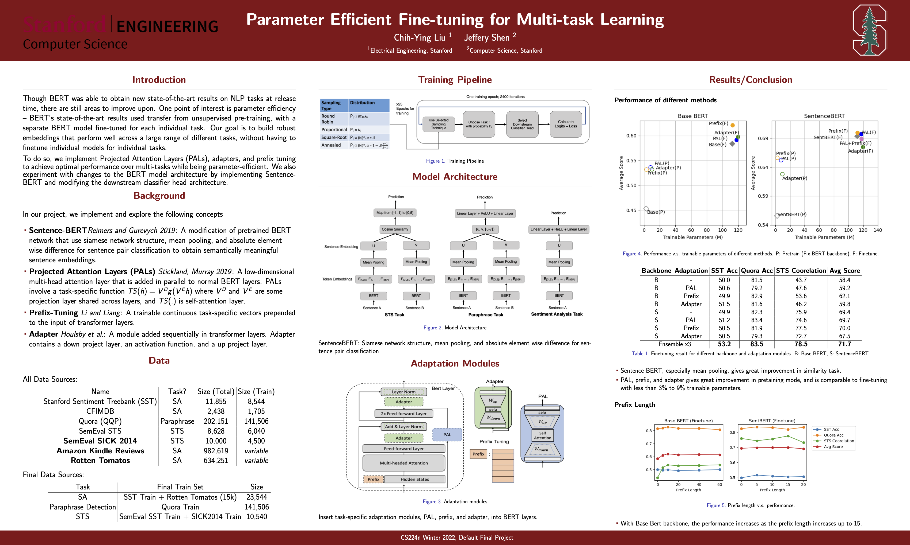

# Parameter Efficient Fine-tuning for Multi-task Learning
This is the final project for the Stanford CS 224N class adapted from [here](https://github.com/gpoesia/minbert-default-final-project.git). This project aims to implement, utilize, and improve upon the BERT model to perform sentiment analysis, paraphrase detection, and semantic textual similarity. We implement Projected Attention Layers (PALs), adapters, and prefix tuning to achieve optimal performance over multi-tasks while being efficient. We also experiment with changes to the BERT model architecture by implementing Sentence-BERT and modifying the downstream classifier head architecture. 

Please refer to the [report](CS_224N_Final_Report.pdf) for further details.

## Setup instructions

* Follow `setup.sh` to properly setup a conda environment and install dependencies.
* There is a detailed description of the code structure in [STRUCTURE.md](./STRUCTURE.md), including a description of which parts you will need to implement.

## Usage

```
python multitask_classifier.py --option [finetune/pretrain] --use_gpu\
	--output_dir OUTPUT_DIR\
    --epochs 25 --lr 1e-5 --lr_adapt 1e-4 --warmup_portion 0.1\
    --batch_size 16 --steps_per_epoch 2400 --eval_interval 4\
    --gradient_accumulation_step 1\
    --hidden_dropout_prob 0.1\
    --sample [rr, squareroot, anneal]\
    --config_path CONFIG_PATH \
    --similarity_classifier_type ['linear', 'cosine-similarity']\
    --paraphrase_classifier_type ['linear', 'cosine-similarity']\
    --pooling_type ['cls', 'mean', 'max']\
    --classification_concat_type ['naive', 'add-abs']\  
```
### Argument
- Training pipeline
    - ```--sample```: sampling strategy described in Stickland and Murray (2019).
- Adaptation modules
    - ```--config_path```: define adaptation modules (PAL, adapter, prefix) and their hyperparameters.
- Model architecture
    The following arguments define various model architecture based on Sentence-BERT.
    - ```--similarity_classifier_type```, ```--paraphrase_classifier_type```: apply linear layer or calculate cosine similarity between two representations.
    - ```--pooling_type```: use cls token, mean pooling, or max pooling.
    - ```--classification_concat_type```: whether add absolute difference term.

## Result

 Finetune/Pretrain | Backbone | Adaptation | Trainable Param (M) | SST | Quora | STS | Avg
 ---|---|---|---|---|---|---|---
Pretrain | Base BERT | - | 3.0 | 41.1 | 67.5 | 27.2 | 45.3
Pretrain | Base BERT | PAL | 8.4 | **52.0** | 73.9 | 34.9 | 53.6
Pretrain | Base BERT | Prefix | 3.2 | 50.5 | 72.3 | 36.7 | 53.2
Pretrain | Base BERT | Adapter | 10.2 | 50.3 | 75.5 | 33.8 | 53.2
Pretrain | Sentence-BERT | - | 2.4 | 45.0 | 72.2 | 49.5 | 55.6
Pretrain | Sentence-BERT | PAL | 7.8 | 48.1 | 73.1 | **74.4** | 65.2
Pretrain | Sentence-BERT | Prefix | 2.6 | 47.0 | **77.5** | 72.3 | **65.6**
Pretrain | Sentence-BERT | Adapter | 9.6 | 43.7 | 76.5 | 68.1 | 62.8
Finetune | Base BERT | - | 112.4 | 50.0 | 81.5 | 43.7 | 58.4 
Finetune | Base BERT | PAL | 117.9 | 50.6 | 79.2 | 47.6 | 59.2 
Finetune | Base BERT | Prefix | 112.7 | 49.9 | 82.9 | 53.6 | 62.1 
Finetune | Base BERT | Adapter | 119.7 | 51.5 | 81.6 | 46.2 | 59.8
Finetune | Sentence-BERT | - | 111.8 | 49.9 | 82.3 | 75.9 | 69.4 
Finetune | Sentence-BERT | PAL | 117.3 | 51.2 | **83.4** | 74.6 | 69.7
Finetune | Sentence-BERT | Prefix | 112.1 | 50.5 | 81.9 | **77.5** | **70.0** 
Finetune | Sentence-BERT | Adapter | 119.7 | 50.5 | 79.3 | 72.7 | 67.5
Ensemble x3 ||| **53.2** | **83.5** | **78.5** | **71.1**

## Poster



### Acknowledgement

The BERT implementation part of the project was adapted from the "minbert" assignment developed at Carnegie Mellon University's [CS11-711 Advanced NLP](http://phontron.com/class/anlp2021/index.html),
created by Shuyan Zhou, Zhengbao Jiang, Ritam Dutt, Brendon Boldt, Aditya Veerubhotla, and Graham Neubig.

Parts of the code are from the [`transformers`](https://github.com/huggingface/transformers) library ([Apache License 2.0](./LICENSE)).
